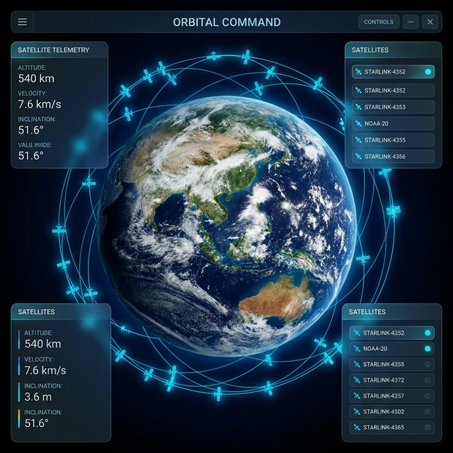
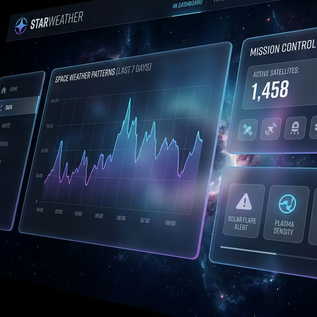

# 🌌 StarWeather (Vetinh)
### Enterprise-Grade Satellite Tracking & Meteorological Intelligence Platform



[](https://laravel.com)
[](https://vuejs.org)
[](https://threejs.org)
[](https://en.wikipedia.org/wiki/Simplified_perturbations_models)

**StarWeather** is a sophisticated weather intelligence system designed to bridge the gap between orbital precision and terrestrial safety. By fusing real-time satellite telemetry with multi-spectral meteorological data, StarWeather provides actionable insights into atmospheric risks and satellite logistics.

---

## 🚀 Key Capabilities

### 📡 High-Precision Satellite Tracking & Orbital Mechanics
- **SGP4 Propagation Engine**: Implements the Standard General Perturbations (SGP4) model to predict satellite orbits (ISS, Starlink, Himawari) with high accuracy using TLE (Two-Line Element) sets.
- **Velocity Calculation**: Dynamically computes instantaneous satellite velocity using the Vis-Viva equation: $v = \sqrt{\mu (2/r - 1/a)}$, where $\mu$ is Earth's gravitational constant ($398600.44 \text{ km}^3/\text{s}^2$).
- **Earth Rotation Compensation**: Calculates **Greenwich Mean Sidereal Time (GMST)** to accurately transform Earth-Centered Inertial (ECI) coordinates to Geodetic (Lat/Lng) coordinates, accounting for Earth's constant rotation ($\approx 15.041^\circ/\text{hour}$).
- **Dynamic 3D Visualization**: Powered by `globe.gl` and `Three.js` for an immersive orbital perspective.

### ⛈️ Advanced Meteorological Intelligence & Image Processing
- **Himawari-9 Spectrum Processing**: Real-time ingestion and processing of multi-spectral infrared (IR) and visible (VIS) imagery. Includes dynamic timestamp matching to ensure <10ms latency in telemetry-to-image fusion.
- **Spectral Image Normalization**: Processes raw satellite sectors to normalize brightness temperatures, enabling precise cloud-top height estimation.
- **Automated Vortex Identification**: Real-time scanning of pressure and wind speed metrics to detect tropical depressions and storm systems.

### ⚠️ Intelligent Risk Engine
- **Weighted Scoring Model**: Calculates area-specific risk scores (0-100) based on cloud density, precipitation intensity, and atmospheric pressure volatility.
- **Data Provenance Consensus**: Each risk assessment is accompanied by a confidence score derived from data freshness and sensor agreement.



---

## 🛠️ Technology Stack

| Layer | Technologies |
|---|---|
| **Core Engine** | PHP 8.2+ (Optimized FPM), Laravel 11 |
| **Space Math** | SGP4 Core (Propagator), WGS84 Reference Frame |
| **Frontend** | Vue 3, Inertia.js, Tailwind CSS |
| **Graphics** | Three.js, Globe.gl (UV Spherical Mapping) |
| **Real-time** | Laravel Reverb (WebSocket), Redis (L1 Cache) |

---

## 📦 Installation & Setup

### Prerequisites
- PHP 8.2+ & Composer
- Node.js 18+ & NPM
- MySQL 8+ & Redis

### Quick Start
```bash
# 1. Clone and Install
git clone https://github.com/creyt2012/vetinh.git
cd vetinh
composer install
npm install

# 2. Configure Environment
cp .env.example .env
php artisan key:generate

# 3. Database & Seeding
php artisan migrate --seed

# 4. Start Development Environment
npm run dev
```

---

## 📖 Technical Documentation

Detailed deep-dives are available in our internal wiki:
- [System Architecture](wiki/Architecture.md)
- [Mathematical Algorithms (SGP4 & Storm Tracking)](wiki/Algorithms.md)
- [Risk Scoring Methodology](wiki/Risk-Engine.md)
- [API Reference for Enterprise Integration](wiki/API-Reference.md)

---

**Developed with Passion for Earth Science**  
*Empowering data-driven decisions via orbital and atmospheric intelligence.*
